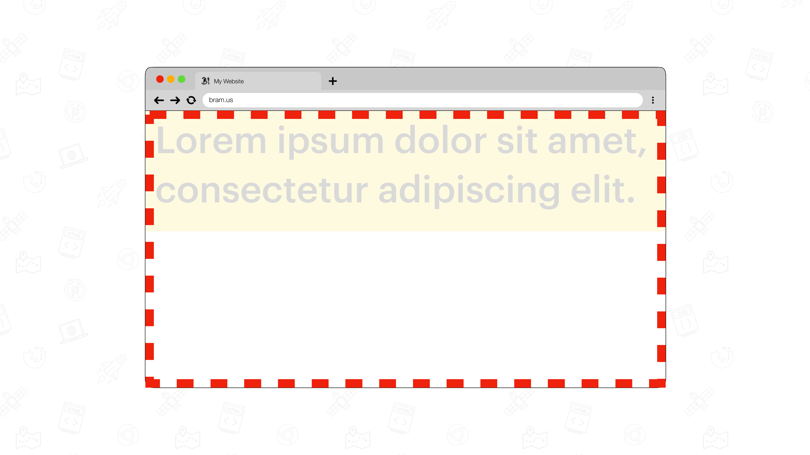
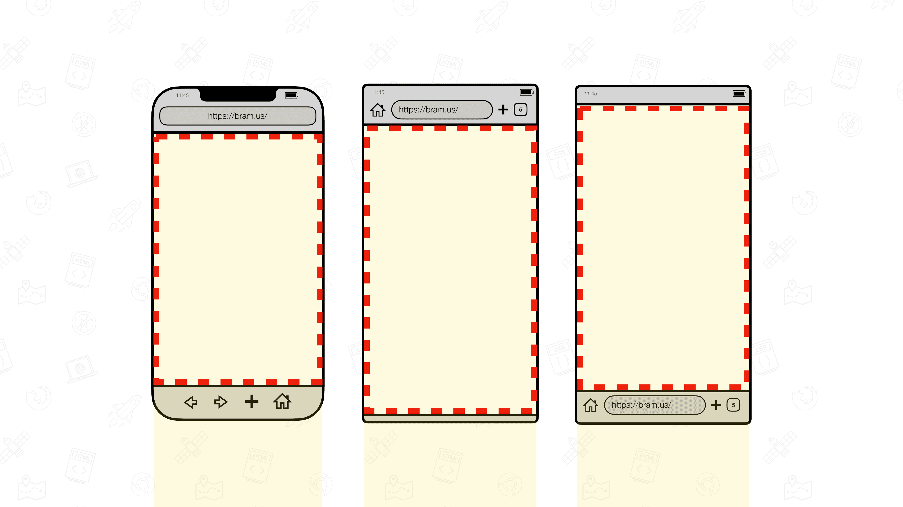
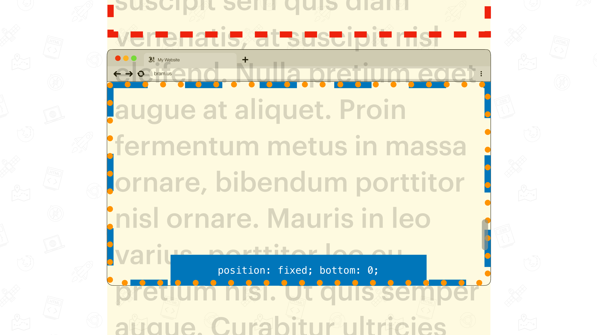
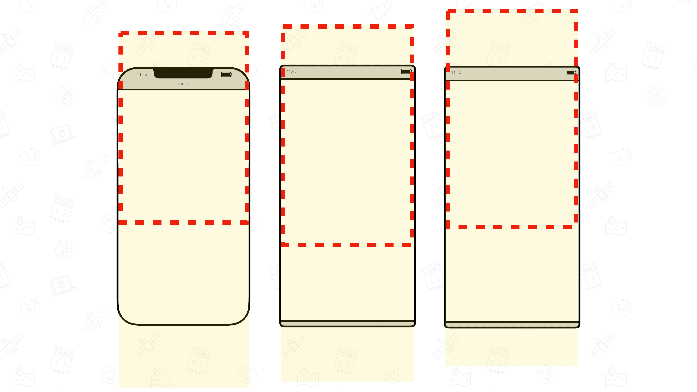

# Initial Containing Block

## Definition

The Initial Containing Block – or ICB for short – is [defined in the CSS2 spec](https://drafts.csswg.org/css2/#containing-block-details):

> The position and size of an element’s box(es) are sometimes calculated relative to a certain rectangle, called the containing block of the element. The containing block in which the root element[^fn1] lives is a rectangle called the initial containing block. 
[^fn1]: Root Element = the `html` element – [DOM Living Standard: The `html` element](https://html.spec.whatwg.org/multipage/semantics.html#the-html-element)

It takes its size from [the Layout Viewport](./layout-viewport.md) _(for continuous media)_:

> For continuous media, it has the dimensions of the viewport[^fn2] and is anchored at the canvas origin

[^fn2]: Back when CSS2 was defined, it had no notion of different viewports. When spec talk about _“the Viewport”_, they mean [the Layout Viewport](./layout-viewport.md).

## Visualization

To visualize it, authors can use this CSS snippet:

```css
html {
	width: 100%;
	height: 100%;
	outline: 10px dashed red;
	outline-offset: -10px;
}
```

👉 Try it out: [Initial Containing Block (ICB)](https://interop-2022-viewport.netlify.app/individual/icb/)

## Measuring the ICB

To get the actual size of the ICB, authors do not need to size the root element to be `100%` and measure it that way, but can use this JS snippet:

```js
document.documentElement.clientWidth;
document.documentElement.clientHeight;
```

This due to [an exception in the definition of `clientWidth`/`clientWidth`](https://www.w3.org/TR/cssom-view-1/#dom-element-clientwidth)

> If the element is the root element and the element’s node document is not in quirks mode […] return the viewport width/height excluding the size of a rendered scroll bar (if any).

💡 You might think `window.innerWidth` and `window.innerHeight` might also get you these values, but that’s not the case. Some browsers resize those values as you pinch-zoom in. The values for the `document.documentElement.clientWidth`/`.clientHeight` properties remain stable and are not affected by pinch-zooming.

## Findings

💡 These findings are a textual representation of the [test results table](https://goo.gle/interop-2022-viewport-testresults).

### Size

In desktop browsers, the ICB – as specced – follows the size of the [Layout Viewport](./layout-viewport.md).



In mobile browsers the ICB has the same size as the [Layout Viewport](./layout-viewport.md) after initial load which has expanded dynamic UA UI Elements. This is also known as the [Small Viewport](./viewport-units.md).



There, the pixel width of the ICB is determined by the `viewport` meta tag:

- `<meta name="viewport" content="width=device-width">` sizes the width of the ICB in relation to the device’s width
- `<meta name="viewport" content="width=value">` sizes the width of the ICB to the given value, e.g. `2000px`
- Lack of a `<meta name="viewport">` tag makes user agents fall back to a default ICB width of `980px`.

### Effect of scrolling

As specced, the ICB is anchored to the canvas origin on which the document is painted. As a result, the ICB slides out of view as you scroll down a page. 




On Mobile, the ICB remains the same size in most browsers, except for a few outliers: they resize the ICB as the UA UI gets hidden. Note that in that case, these browsers do not resize the ICB to match the size of the [Layout Viewport](./layout-viewport.md) but use an in-between value.



### Effect of scrollbars

When operating systems use [Classic Scrollbars](./scrolling.md#classic-scrollbars), the ICB shrinks. This is because those browsers resize the [Layout Viewport](./layout-viewport.md), upon which the ICB size is based. [Overlay Scrollbars](./scrolling.md#overlay-scrollbars) have no effect on the size of the ICB.


### Effect of pinch-zoom

When pinch-zooming in the ICB does not get resized because the [Layout Viewport](./layout-viewport.md) – upon which the ICB size is based – does not resize either.


### Effect of the Virtual Keyboard

See [Virtual Keyboard: Findings](./virtual-keyboard.md#findings).

### Relation to Viewport Units

Their name might not indicate it, but the [Viewport Units](./viewport-units.md) are sized in relation to [the ICB](./icb.md). See [Viewport Units](./viewport-units.md) for details.

## Issues

We are tracking issues using [the label `ICB`](https://github.com/web-platform-tests/interop-2022-viewport/issues?q=is%3Aissue+label%3AICB)