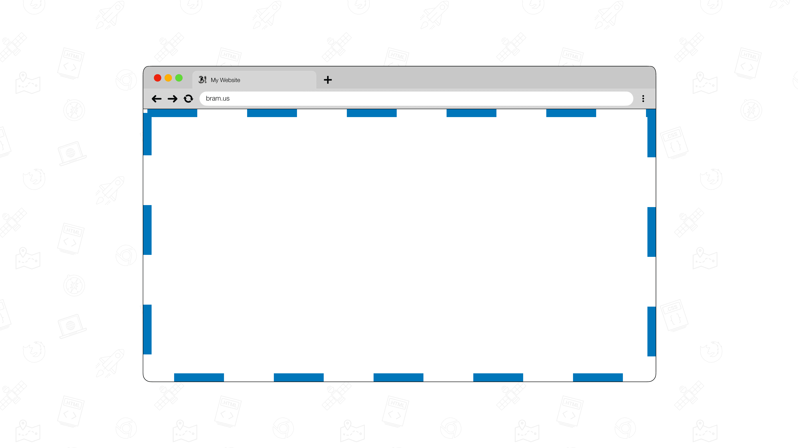
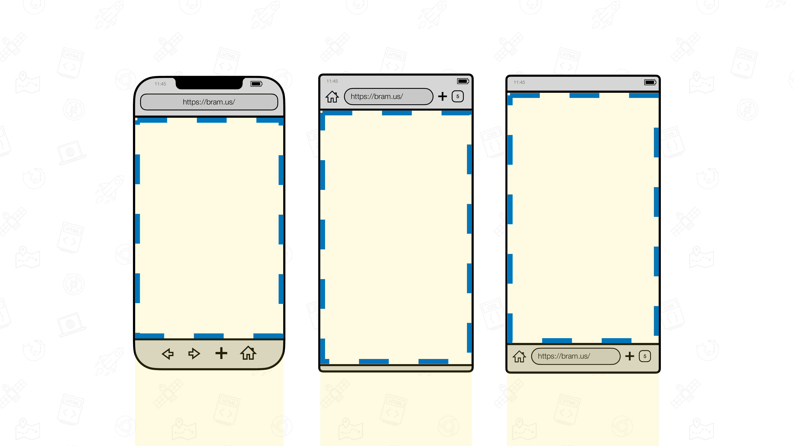
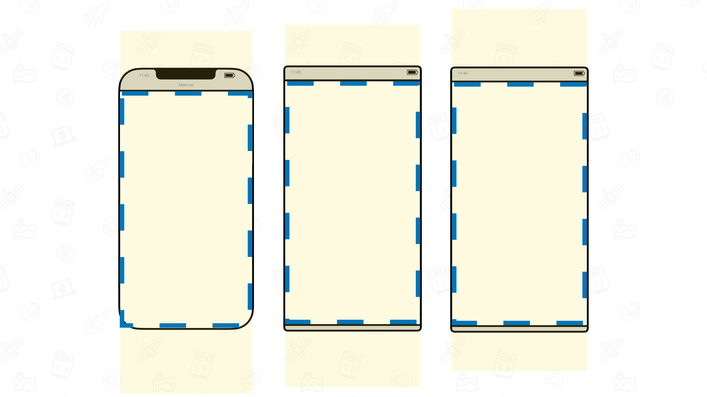
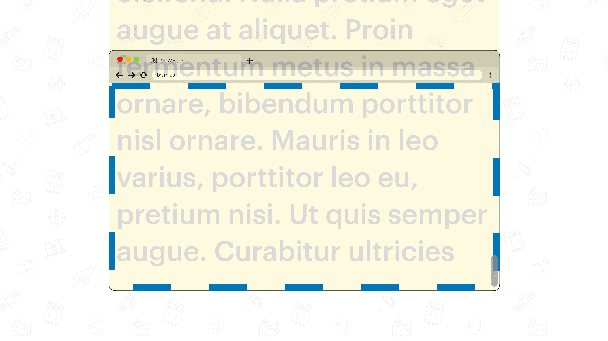
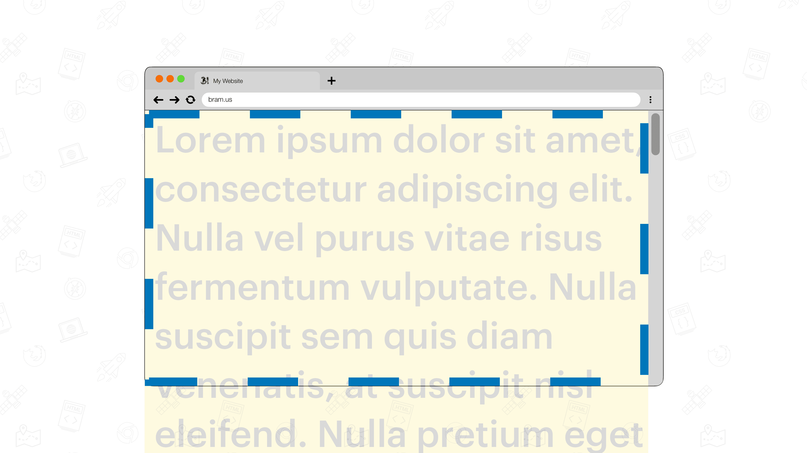
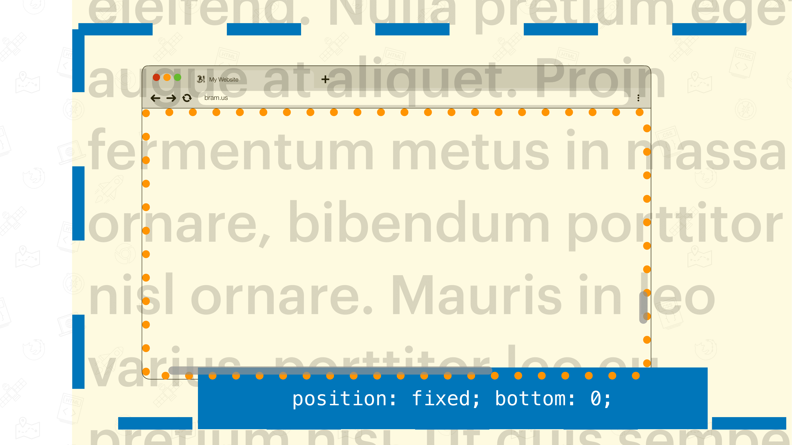

# The Layout Viewport

## Definition

The Layout Viewport is [defined in the CSS2 spec](https://drafts.csswg.org/css2/#viewport):

> User agents for continuous media generally offer users a viewport _(a window or other viewing area on the screen)_ through which users consult a document. User agents may change the document’s layout when the viewport is resized _(see the [initial containing block](./icb.md))_.
> 
> When the viewport is smaller than the area of the canvas on which the document is rendered, the user agent should offer a scrolling mechanism.
> 
> There is at most one viewport per canvas, but user agents may render to more than one canvas (i.e., provide different views of the same document)."

The [definition on MDN](https://developer.mozilla.org/en-US/docs/Glossary/Layout_viewport) reads:

> The layout viewport is the viewport into which the browser draws a web page. Essentially, it represents what is available to be seen, while the visual viewport represents what is currently visible on the user's display device.
> 
> This becomes important, for example, on mobile devices, where a pinching gesture can usually be used to zoom in and out on a site's contents. The rendered document doesn't change in any way, so the layout viewport remains the same as the user adjusts the zoom level. Instead, the [visual viewport](./visual-viewport.md) is updated to indicate the area of the page that they can see.

## Visualization

To visualize it, authors can inject an empty HTML element and have it positioned against the edges using `position: fixed`:

```css
#layoutviewport {
	position: fixed;
	inset: 0;
	outline: 5px dashed var(--blue);
	outline-offset: -5px;
}
```

👉 Try it out: [Layout Viewport](https://interop-2022-viewport.netlify.app/individual/layout-viewport/)

## Measuring the Layout Viewport

Using `.getBoundingClientRect()` on the injected `#layoutviewport` element, its size in pixels can be determined:

```js
const {
	width,
	height,
} = document.querySelector("#layoutviewport").getBoundingClientRect();
```

💡 You might think [`window.innerWidth` and `window.innerHeight`](./sizing.md#windowinnerwidth-and-windowinnerheight) might also get you these values, but that’s not the case: Some browsers resize those values as you pinch-zoom in.

## Relation to `position: fixed`

Elements that use `position: fixed`, are layed out against the Layout Viewport, as specified in the [CSS Positioned Layout Module](https://drafts.csswg.org/css-position/#valdef-position-fixed)

> Same as `absolute`, except the box is positioned and sized relative to a fixed positioning containing block (usually the viewport in continuous media […])
> The box’s position is fixed with respect to this reference rectangle: when attached to the viewport it does not move when the document is scrolled […].

## Findings

💡 These findings are a textual representation of the [test results table](https://goo.gle/interop-2022-viewport-testresults).

### Size

The Layout Viewport is sized to area through which a user views the document. As you resize the browser, the viewport size is also affected.



This is also the case on mobile where the browser can expand/contract dynamic UA UI Elements such as address bars and toolbars.





### Effect of scrolling

The Layout Viewport spans the entire viewport and remains in place as you scroll down a page.



On mobile, browsers contract dynamic UA UI elements as you scroll down a page. These elements can be expanded again as you scroll up. The Layout Viewport follows the size. See visualizations above.

### Effect of scrollbars

When operating systems use [Classic Scrollbars](./scrolling.md#classic-scrollbars), the Layout Viewport shrinks. [Overlay Scrollbars](./scrolling.md#overlay-scrollbars) have no effect on the size of the Layout Viewport.



### Effect of pinch-zoom

When pinch-zooming in the Layout Viewport does not get resized. This is both the case on Desktop and on Mobile.



### Effect of the Virtual Keyboard

See [Virtual Keyboard: Findings](./virtual-keyboard.md#findings).

### Effect of Overscrolling / Bouncy Scroll

When [overscrolling](./scrolling.md#overscrolling-and-rubber-banding), some browsers move the Visual Viewport as it bounces while others do not. A [recent CSSWG Resolution](https://github.com/w3c/csswg-drafts/issues/6299#ref-commit-617c50c) explicitly disallows this behavior:

> If an element uses [fixed positioning](#relation-to-position-fixed) and is positioned relative to the [initial containing block](./icb.md), or is a sticky positioned element which is currently stuck to the viewport, then when the root scroller experiences "overscroll", that element must not overscroll with the rest of the document’s content; it must instead remain positioned as if the scroller was at its minimum/maximum scroll position, whichever it will return to when the overscroll is finished.

This behavior newly specced behavior is supported by all WebKit-based browsers on iOS (Safari + Chrome + Edge + Firefox), Firefox on macOS, Chrome on macOS _(with a feature flag)_. This behavior is not supported by Safari on macOS. Android devices do not support overscrolling, so this updated behavior does not affect them.
### Relation to Viewport Units

Unlike its name suggest, the [Viewport Units](./viewport-units.md) are not sized in relation to the Layout Viewport. Instead, they are sized in relation to [the ICB](./icb.md). See [Viewport Units](./viewport-units.md) for details.

## Issues

We are tracking issues using [the label `Layout Viewport`](https://github.com/web-platform-tests/interop-2022-viewport/issues?q=is%3Aissue+label%3A%22Layout+Viewport%22)