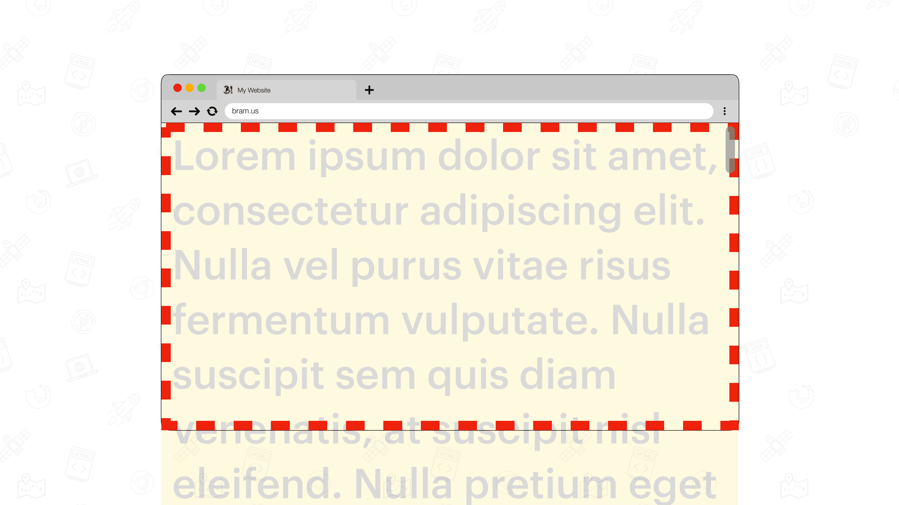
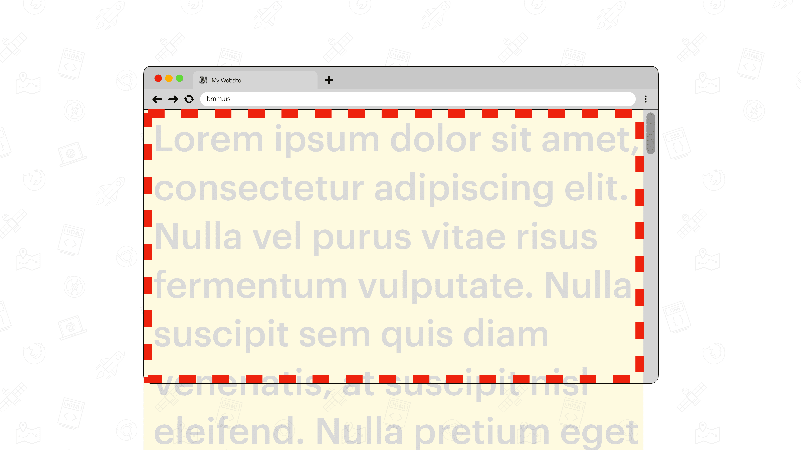

# Scrolling

## Scrollbars

As [per CSS2 spec](https://drafts.csswg.org/css2/#viewport):

> When [the viewport](./layout-viewport.md) is smaller than the area of the canvas on which the document is rendered, the user agent should offer a scrolling mechanism.

This scrolling mechanism – most of the time – also comes with scrollbars. There are two types of scrollbars we can distinguish:

1. Overlay Scrollbars
2. Classic Scrollbars

Controlling the visual styling of these scrollbars is defined in the [CSS Scrollbars Styling Module Level 1](https://w3c.github.io/csswg-drafts/css-scrollbars-1/) spec.
### Overlay Scrollbars

Overlay Scrollbars are those iOS/macOS-style scrollbars which are placed over the content. They are not shown by default, but only while the user is scrolling. To keep the content underneath visible they are semi-transparent, but that’s totally up to the user-agent (browser) to determine. While interacting with them, their size may also vary.

### Classic Scrollbars

Classic Scrollbars are scrollbars that are placed in a dedicated Scrollbar Gutter. The Scrollbar Gutter is the space between the inner Border Edge and the outer Padding Edge. These scrollbars are usually opaque (not transparent) and take away some space from the adjacent content.

## Getting the Scroll Position

- @TODO: `window.scrollX` / `window.scrollY`
- @TODO: `document.scrollLeft` / `document.scrollTop`

## Findings

💡 These findings are a textual representation of the [test results table](https://goo.gle/interop-2022-viewport-testresults).

### Dynamic User-Agent UI Elements

@TODO:
### Overscrolling and Bounce Scroll

Some browsers support overscrolling the scrollport. When doing this with a swipe gestured, they might bounce back. This behavior is available on macOS, iOS _(and maybe Windows, but that is currently untested). Android does not support this.

Note: When overscrolling slowly at the top edge in Mobile Browsers you might trigger a pull-to-refresh. In this part we are focussing on overscrolling while not triggering pull-to-refresh.

Overscrolling is [covered in the “CSS Overscroll Behavior Module Level 1” spec](https://drafts.csswg.org/css-overscroll-1/).