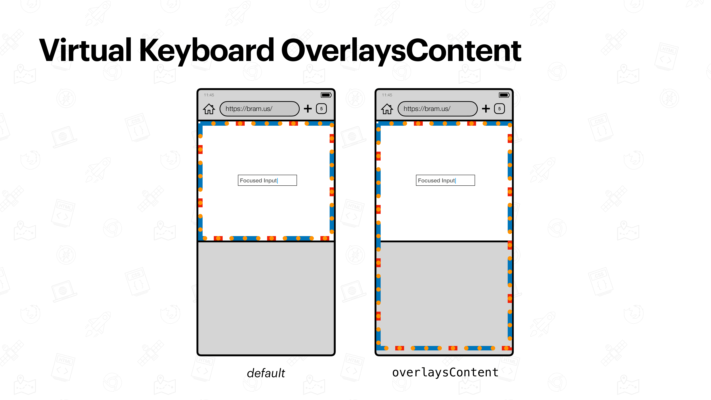

# The Virtual Keyboard API

## Definition

With the Virtual Keyboard API, authors can get information about the Virtual Keyboard. This is defined in [the Virtual Keyboard API Specification](https://www.w3.org/TR/virtual-keyboard/)

> The VirtualKeyboard API provides authors with greater control over the visibility of the Virtual Keyboard, and greater ability to adapt the layout of web pages when VK visibility changes

## Using the API

Authors can listen for a `geometrychange` event to get the Virtual Keyboard size.

```js
if ("virtualKeyboard" in navigator) {
	navigator.virtualKeyboard.addEventListener('geometrychange', () => {
		console.log(vk.boundingRect);
	});
}
```

Additionally they can also trigger it to show or hide.

## Overlays Content Mode

Using the Virtual Keyboard API, authors can change the behavior of the Virtual Keyboard. The only option they have now, is to enable “Overlays Content” mode. This behavior needs to be enabled through JavaScript:

```js
if ("virtualKeyboard" in navigator) {
	navigator.virtualKeyboard.overlaysContent = true;
}
```

Once enabled, this mode does not resize the [Layout Viewport](./layout-viewport.md), [ICB](./icb.md), nor [Visual Viewport](./visual-viewport.md) when the [Virtual Keyboard](./virtual-keyboard.md) is shown.



## Browser Support

The Virtual Keyboard API is only implemented in Chromium-based browsers. Other browser vendors have been asked on their position towards this API:

- Firefox: [https://github.com/mozilla/standards-positions/issues/531](https://github.com/mozilla/standards-positions/issues/531)
- WebKit: [https://github.com/WebKit/standards-positions/issues/16](https://github.com/WebKit/standards-positions/issues/16)