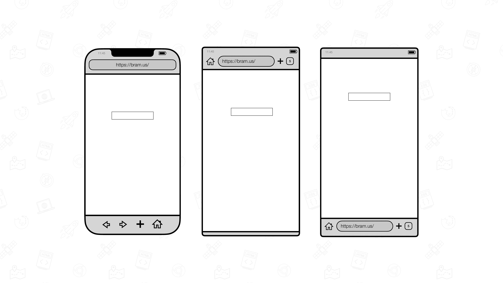
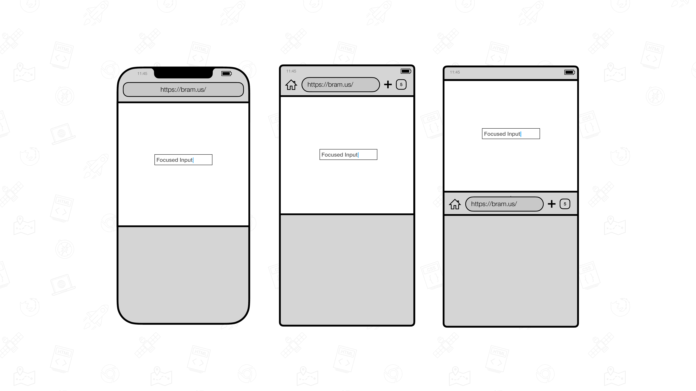
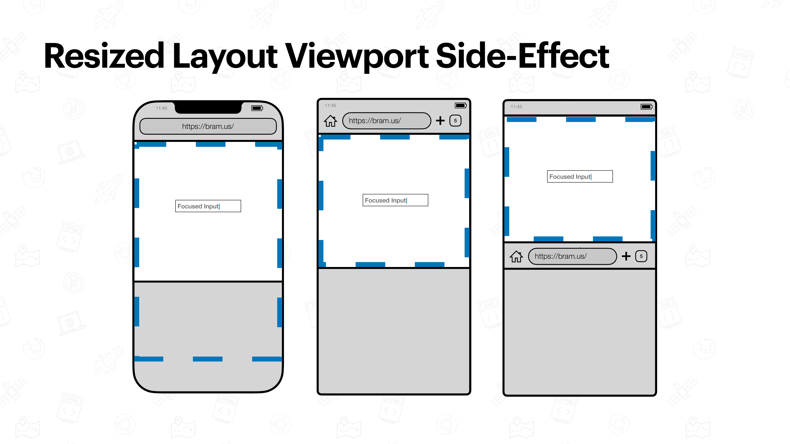
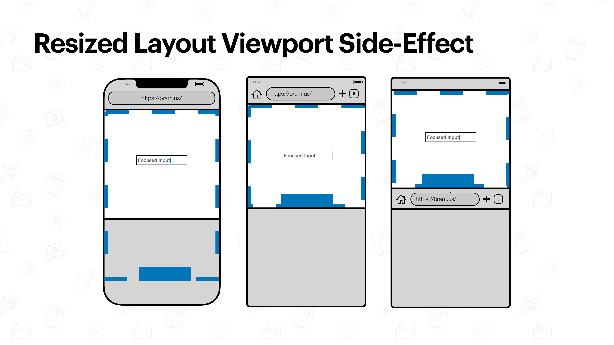
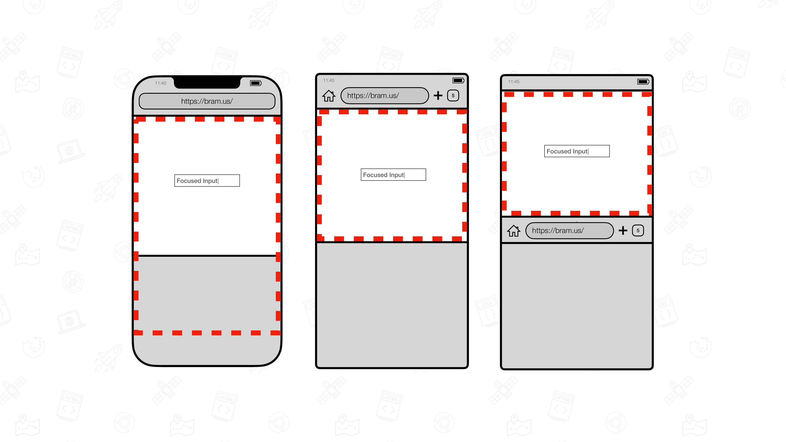
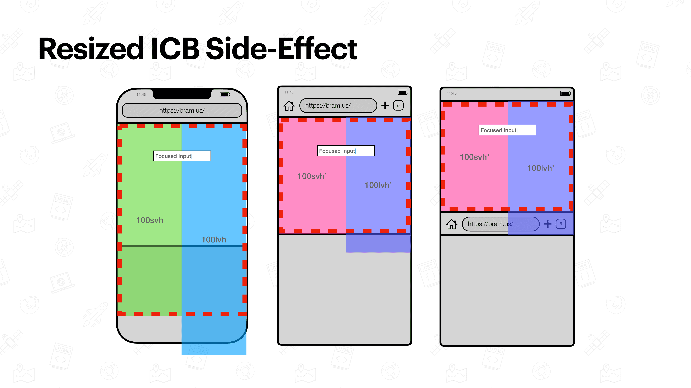
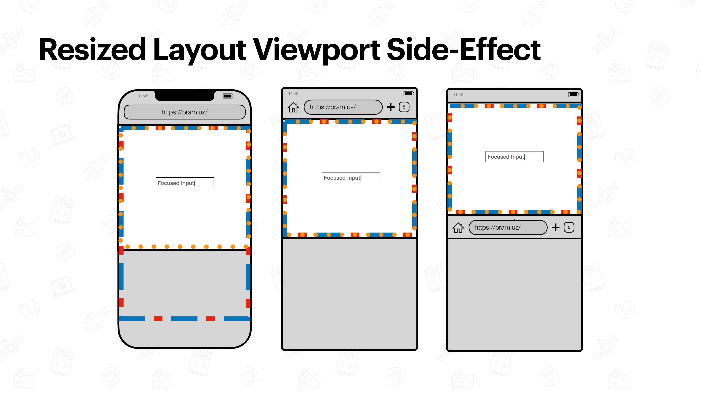
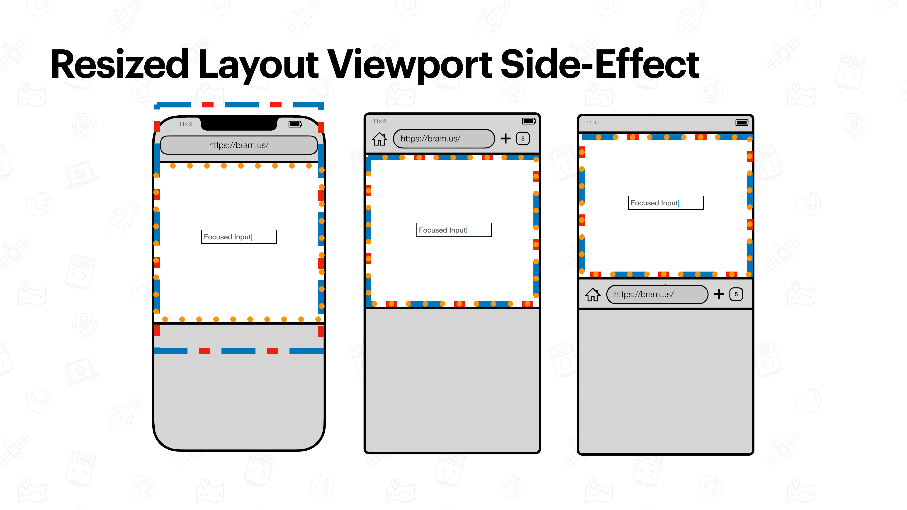

# Virtual Keyboard

## Definition

Devices with a touchscreen mostly offer a On-Screen Keyboard also known as the Virtual Keyboard.

[The Virtual Keyboard API Specification](https://www.w3.org/TR/virtual-keyboard/) has a section how the Virtual Keyboard affects a browser

> The Virtual Keyboard (VK) is the on-screen keyboard used for input in scenarios where a hardware keyboard may not be available.
> 
> User agents respond to the presence of the VK, without any exposure of this information to web developers in the following way: 
>
> 1. Repositioning the user agent above the VK
> 2. Reducing the size of the [layout viewport](./layout-viewport.md) so the VK doesn't occlude it[^fn1]
> 3. Reducing the size of the [visual viewport](./visual-viewport.md) and padding the layout viewport to ensure it can be shifted above the VK[^fn2]

[^fn1]: This is the current behavior of Chrome on Android
[^fn2]: This is the current behavior of Safari on iOS

💡 The [Virtual Keyboard API](./virtual-keyboard-api.md) adds a fourth option to this list of behaviors.

## Findings

💡 These findings are a textual representation of the [test results table](https://goo.gle/interop-2022-viewport-testresults).

### Effect on the Layout Viewport

The effect of the [Virtual Keyboard](./virtual-keyboard.md) on the [Layout Viewport](./layout-viewport.md) is currently not interoperable, as _some_ browsers resize the Layout Viewport when the Virtual Keyboard gets shown, while others do not resize it.

Because [`position: fixed` elements are laid out against the Layout Viewport](./layout-viewport.md#relation-to-position-fixed), that might mean that some of those elements get obscured by the keyboard

This latter behavior might be troublesome if authors want to keep an element positioned against the bottom edge, above the Virtual Keyboard when present.

💡 The [Virtual Keyboard API](./virtual-keyboard-api.md) has an option to opt-out of resizing the Layout Viewport in case the Virtual Keyboard is present.
### Effect on the ICB

Because the ICB is based on the size of the [Layout Viewport](./layout-viewport.md), browsers that resize the Layout Viewport also resize the ICB.

This difference in resize-behavior has an effect on [Viewport Units](./viewport-units.md)

### Effect on the Visual Viewport

The Visual Viewport resizes the the Virtual Keyboard gets shown. This is consistent across Mobile Browsers.

### Auto-scrolling input elements into view

When an element that might get obscured by the Virtual Keyboard gains focus, some browsers auto-offset the [Layout Viewport](./layout-viewport.md) so that the input remains in view.

## Issues

We are tracking issues using [the label `Virtual Keyboard`](https://github.com/web-platform-tests/interop-2022-viewport/issues?q=is%3Aissue+label%3A%22Virtual+Keyboard%22)